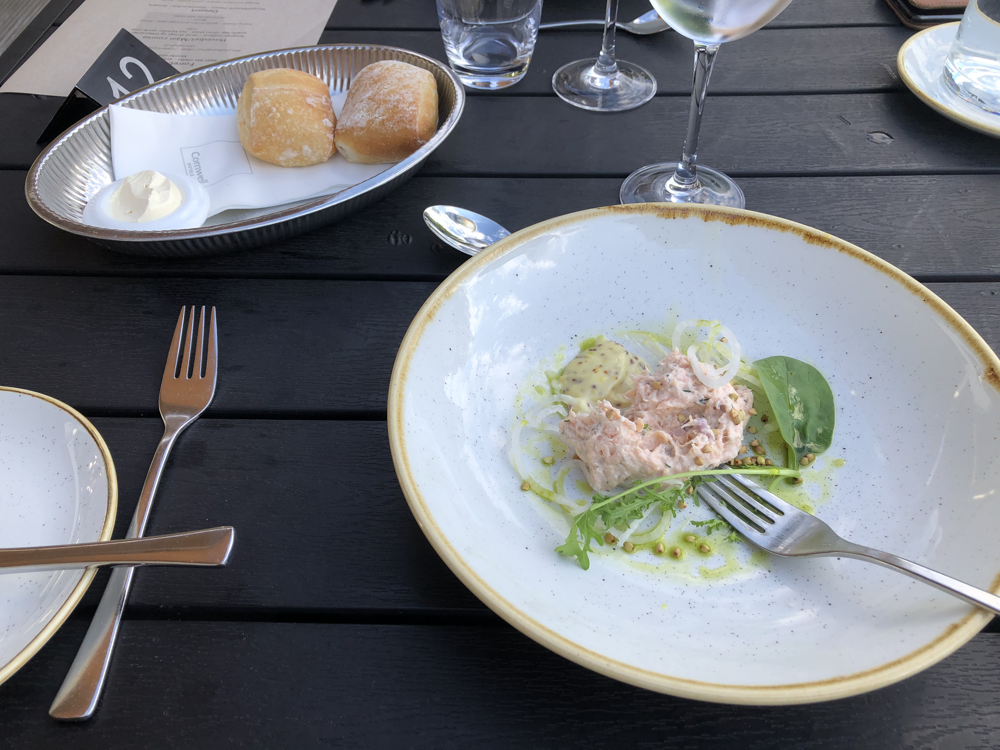
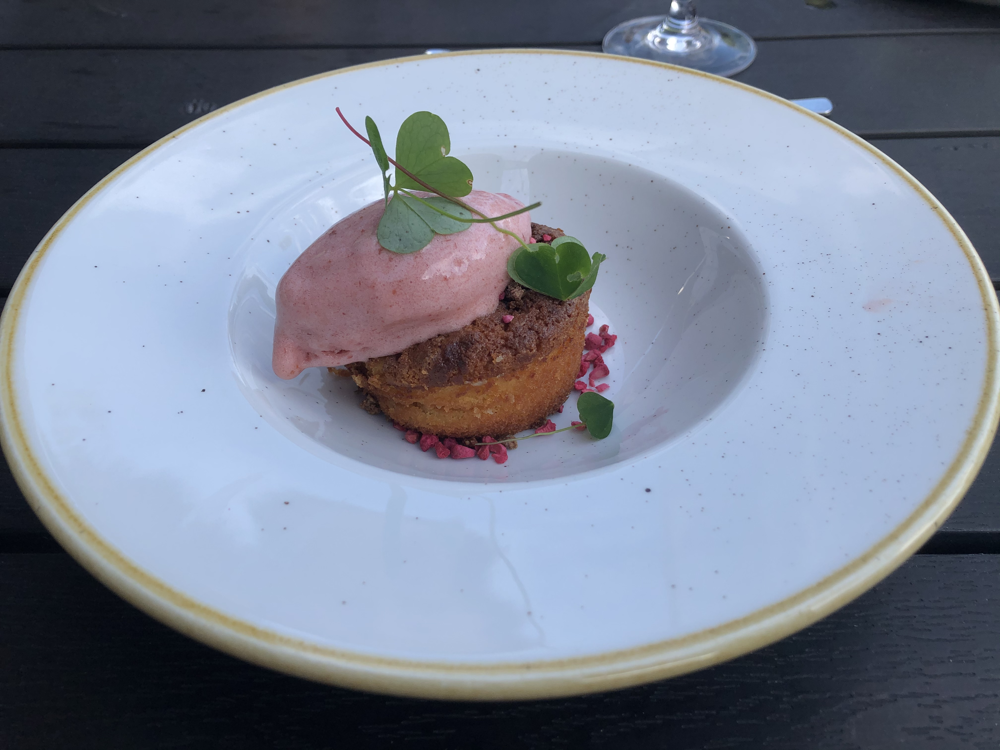

# Comwell Borupgaard 

## Fine dining at Borupgaard (part of Comwell hotels) in Northern Zealand (Snekkersten)

**3 course dinner menu near the ocean**

|  |  |  |
| :---: | :---: | :---: |

At the quiet town of Snekkersten resides the cosy and somewhat secluded spa hotel Borupgaard. As I enter the premises on a warm summer day of 2020, I am met by a subtle and delightful breeze of green grass coming from the large gardens, together with essential oils from the many spas finding its way to my nostrils. The enjoyment is but to begin, as I sink into the comfy restaurant chair to which I have been appointed by the pleasant waiters and hotel staff. A symphony of taste and color is about to unfold before my very eyes.

**Left**: Starter. Hot smoked salmon rillette - mustard emulsion - lettuce - chlorophyll oil. **Center**: Main course. Young rooster - sauté of corn and sugar peas - lemon sauce - new potatoes with herbs. **Right**: Dessert. Nougat and plum mazarin - plum sorbet - sorrel

★★★★☆ Overall a great score of 4 stars!
