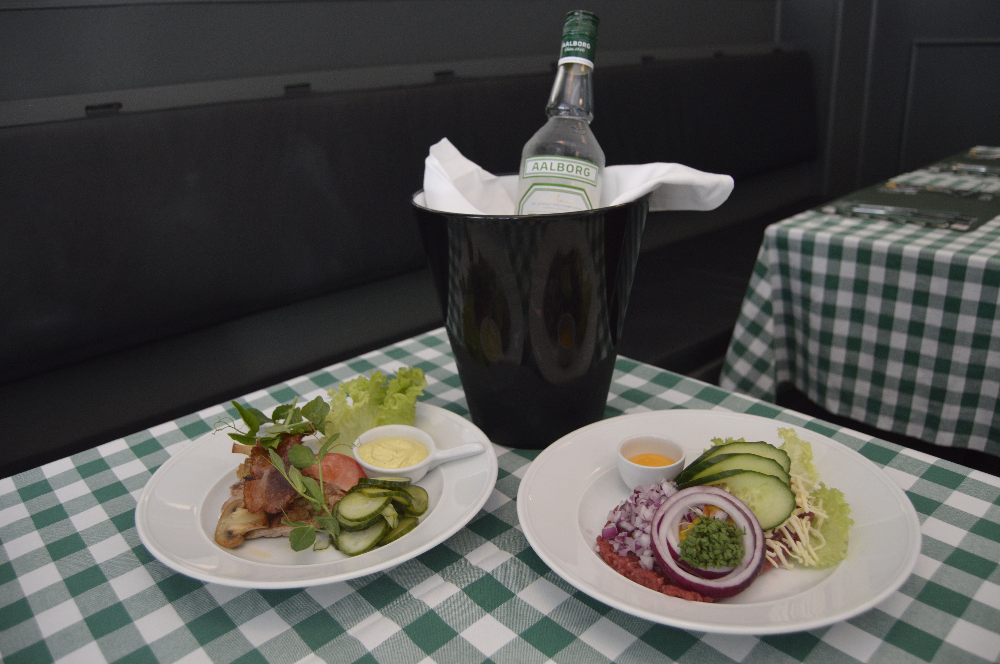
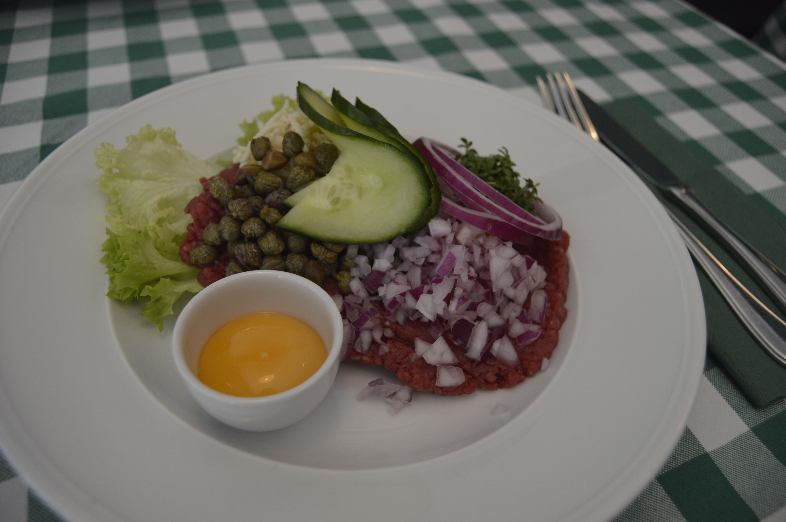
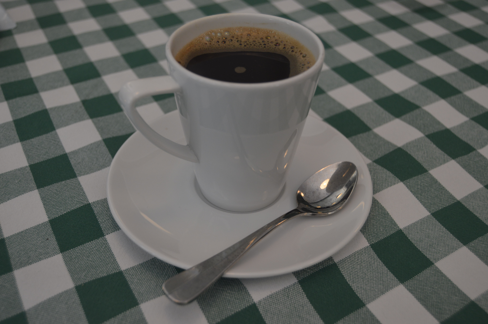

# Frokost Restauranten 

## Unique culinary treasure in the heart of Copenhagen

**Frokostrestauranten 1971 - Frederiksberg**

|  |  |  |  |
| :---: | :---: | :---: | :---: |
|  |  |  |  |

Multiple dimensions of delight awaits anyone entering the Danish lunch restaurant Frokostrestauranten 1971 where one takes a step into Denmark as it stood 100 years back in its cultural pride. Their hospitable spirit carries you through a very fine dining experience embracing solid Danish traditions. Mere moments after the flounder open-faced rye bread sandwich had been enjoyed, together with its avocado sibling, a feast for the eyes and gullet arrived into the cozy green checkered dim dining hall in the form of a tartar steak and tenderloin decorated with champignon-mushrooms, curry sauce and pickled cucumber. Everything washed down by ice cold Carlsberg draft beers, with a grand finale of an energizing french press of fine roast.

_Top_ 
**Left**: Dining hall. **Center left**: Draft beers **Center right**: Flounder **Right**: Avocado open faced rye bread sandwich

_Bottom_ 
**Left**: Tartar steak, tenderloin steak, and a delicious dild akvavit snaps (Aalborg) **Center left**: Tartar steak **Center right**: tenderloin steak **Right**: Fine roast served by french press

Frokostrestauranten 1971 was unfortunately permanently closed August 2025.

★★★★★ Overall a perfect score of 5 stars, highly recommended!
